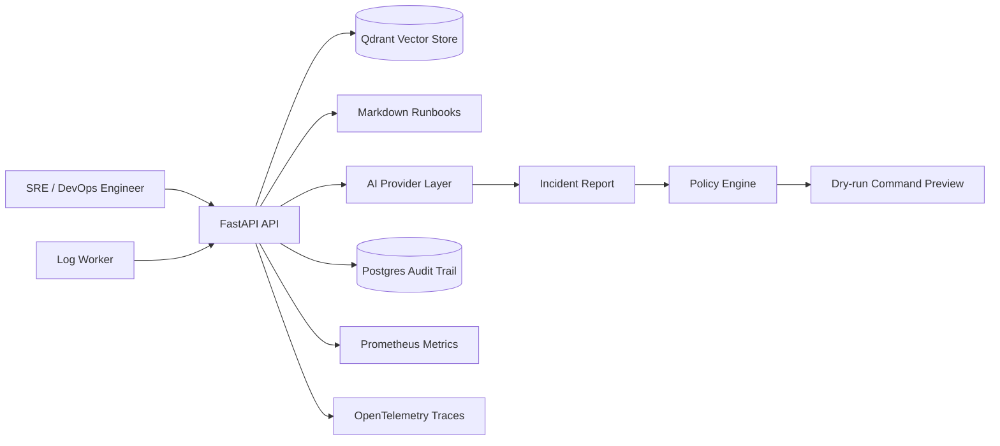

# Architecture

AI SRE Copilot is a production-style incident response platform that uses AI for
triage and planning, but keeps operational control deterministic. The system is
designed as a DevOps/SRE portfolio project: it demonstrates Kubernetes delivery,
observability, policy guardrails, auditability, and AI safety without pretending
that a demo service is a finished enterprise product.

## System Overview

The core workflow is intentionally close to a real incident response loop:

1. A worker sends operational log events to the API.
2. The API embeds and indexes logs in Qdrant.
3. Runbooks are searched as lightweight retrieval context.
4. `POST /incidents/analyze` builds a triage report with evidence, timeline,
   probable cause, confidence, runbook citations, and remediation steps.
5. `POST /actions/plan` evaluates proposed remediation steps against
   policy-as-code.
6. `POST /actions/execute` returns a dry-run command only; real execution is out
   of scope for this API.
7. Every analysis and action decision is written to the audit trail.

## Why Qdrant Over Weaviate, Pinecone, Or pgvector

Qdrant was chosen because it fits the project goals: reproducible local demos,
Kubernetes deployment, explicit vector collection management, and low operational
overhead.

- Qdrant works well with Docker Compose and Helm, so the same design can be
  shown locally and in Kubernetes.
- Qdrant keeps the demo self-contained. There is no SaaS account, external
  control plane, or vendor dependency required for the default path.
- Qdrant exposes vector size and collection state clearly, which is useful for
  readiness checks and embedding-provider migration.
- Qdrant is focused on vector search rather than trying to be a full application
  framework.

Rejected alternatives:

- Weaviate: capable, but heavier for this use case. The GraphQL/object model adds
  operational and conceptual overhead that does not improve the incident demo.
- Pinecone: strong managed vector database, but SaaS-only for the common path.
  That is less suitable for air-gapped, on-prem, or portfolio demos that should
  run locally.
- pgvector: a good choice when Postgres is already the primary data platform.
  For this project, a dedicated vector store better demonstrates vector search
  operations, collection readiness, and separation between audit persistence and
  retrieval infrastructure.

## Why A Dry-run Action Model

AI output is not treated as an execution authority. The copilot can diagnose,
summarize, cite runbooks, and propose operational actions, but it does not run
cluster-changing commands.

The API returns command previews for allowed actions. State-changing actions
require explicit approval, and dangerous actions are denied even if a request
sets `approved=true`.

This design prevents the common failure mode of AI automation projects: letting a
probabilistic model produce operational side effects directly. A production
deployment should use a separate action-runner with narrow Kubernetes RBAC,
timeouts, admission controls, network policy, and its own audit trail.

## Policy Model

Policy lives in `policy/actions.yaml` and is evaluated deterministically.

The policy engine controls:

- allowlisted action names;
- explicitly denied actions;
- allowed namespaces;
- allowed target patterns;
- whether human approval is required.

Examples:

- `rollout_status` is read-only and does not require approval.
- `scale_deployment`, `rollback_deployment`, and `restart_deployment` require
  approval.
- `get_secret`, `exec_shell`, `delete_namespace`, `apply_raw_manifest`, and
  persistent volume deletion are denied.

The policy file is intentionally simple YAML so it can be reviewed like
infrastructure code.

## Security Model

The project uses layered controls rather than relying on one mechanism.

Application controls:

- AI-generated actions pass through deterministic policy.
- The API is dry-run-only for remediation.
- Audit events record generated analyses and action decisions.
- Readiness fails when configured persistent audit storage is unavailable.

Kubernetes controls:

- API and worker run as non-root users.
- Containers use read-only root filesystems.
- Linux capabilities are dropped.
- Privilege escalation is disabled.
- Service account tokens are not mounted into the API and worker pods.
- NetworkPolicy restricts ingress and egress.
- External HTTPS egress is disabled by default and enabled only for OpenAI mode.

Supply-chain controls:

- CI runs tests and AI safety evals.
- CI builds container images.
- Trivy scans the repository and generated SBOMs.
- SBOM artifacts are published for pushed images.
- Images are signed with keyless Cosign in the push pipeline.
- Helm supports digest-pinned images.
- Kyverno examples document runtime hardening and digest-pinned image admission
  checks for the API and worker pods.

## Observability Model

The API exposes Prometheus metrics for request count, latency, and ingested log
levels. The Helm chart includes Prometheus scrape annotations, and the repository
contains a Grafana dashboard for request rate, p95 latency, service errors, pod
restarts, and Loki-oriented error log panels.

OpenTelemetry tracing is optional and enabled through
`OTEL_EXPORTER_OTLP_ENDPOINT`. The API instruments HTTP requests and creates
spans around Qdrant indexing/search operations.

The readiness endpoint checks dependencies that matter for serving traffic:

- Qdrant collection availability and vector size compatibility;
- persistent audit availability when `DATABASE_URL` is configured.

## Embedding And AI Provider Strategy

The default embedding provider is deterministic and local. This makes tests and
demos reproducible without external API keys.

Production-style semantic retrieval can be enabled with OpenAI embeddings:

- `EMBEDDING_PROVIDER=openai`
- `OPENAI_API_KEY`
- `OPENAI_EMBEDDING_MODEL`
- matching `EMBEDDING_DIMENSIONS`

Changing embedding dimensions requires either a fresh Qdrant collection or a new
`QDRANT_COLLECTION` name. This is deliberate: mixing vectors with different
dimensions should fail readiness instead of causing incorrect retrieval.

The current AI provider is rule-based for reproducibility. That keeps the demo
deterministic and makes evals stable. A production provider can be added behind
the provider interface without changing the policy or audit model.

## Persistence And Audit

Postgres is used for persistent audit when `DATABASE_URL` is configured. Local
development can fall back to in-memory audit events, but Kubernetes production
values expect a persistent database URL from a secret.

Audit records include:

- actor;
- action;
- resource;
- decision;
- command preview;
- approval status;
- runbook citation metadata for incident reports.

The audit trail is not a logging substitute. It records operational decisions and
approval outcomes, while logs/metrics/traces serve observability.

## Deployment Model

Local mode uses Docker Compose:

- API;
- worker;
- Qdrant;
- Postgres;
- Redis;
- MinIO.

Kubernetes mode uses Helm:

- API Deployment and Service;
- worker Deployment;
- HPA;
- PDB;
- NetworkPolicy;
- ServiceAccount;
- optional Ingress;
- bundled chart dependencies for portfolio/demo installs.

Production-style values move credentials to external secrets and disable bundled
Postgres when an external audit database is supplied.

## What Is Intentionally Out Of Scope

This project does not execute real Kubernetes remediation commands from the API.
That boundary is intentional.

Out of scope for the current portfolio version:

- a real restricted action-runner;
- multi-tenant authorization;
- full model registry integration;
- production-grade drift detection;
- disaster recovery for Qdrant/Postgres;
- managed cloud networking modules for every environment.

These are valid production follow-ups, but they are not required to demonstrate
the core DevOps/SRE/DevSecOps design.

## Production Hardening Path

The next production steps are clear:

1. Add a restricted action-runner with narrow RBAC and admission checks.
2. Enforce Cosign signature verification at admission time.
3. Pin production images by digest.
4. Store audit logs centrally and define retention.
5. Add structured JSON application logs with model/provider metadata.
6. Add load tests for the incident and action planning endpoints.
7. Add model versioning and simple degradation metrics, such as missing runbook
   citation rate or low-confidence incident reports.

## Interview Summary

The important architecture choice is not "AI calls an API." The important choice
is that AI is constrained by deterministic operational controls:

- retrieval is grounded in runbooks;
- actions are policy checked;
- state changes require approval;
- dangerous operations are denied;
- execution is dry-run-only;
- decisions are auditable;
- deployment and security controls are expressed as code.

That is the difference between an AI chatbot demo and an SRE copilot design that
can be discussed seriously in a DevOps or DevSecOps interview.
