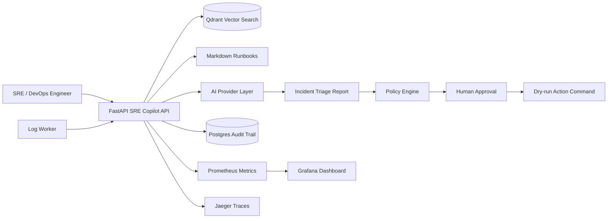
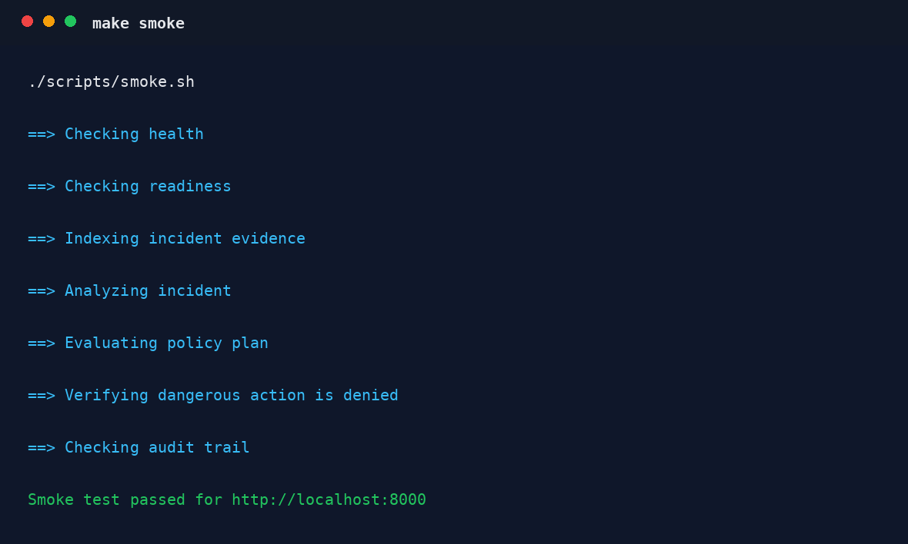

# AI SRE Copilot for Kubernetes Incidents

[](https://github.com/approvefor/k8s-incident-copilot/actions/workflows/ci.yml)


**Kubernetes | Helm | FastAPI | Qdrant | OpenTelemetry | Policy-as-Code | Human Approval | Postgres Audit | AI Evals**

Production-grade DevOps pet project that demonstrates how a DevOps/SRE engineer can use AI safely inside an incident workflow.

This is not a chatbot wrapper. It is an AI-assisted SRE platform that correlates logs, runbooks, Kubernetes context, metrics-style signals, policy guardrails, approvals, audit trail, CI/CD, Helm, and observability.

## Table of Contents

- [Overview](#overview)
- [What It Does](#what-it-does)
- [Skills Demonstrated](#skills-demonstrated)
- [Architecture](#architecture)
- [Local Demo](#local-demo)
- [Demo Output](#demo-output)
- [Guardrails](#guardrails)
- [Evals](#evals)
- [Production Checklist](#production-checklist)
- [Repository Layout](#repository-layout)
- [Interview Positioning](#interview-positioning)

## Overview

The demo shows an AI copilot diagnosing a Kubernetes-style incident, citing runbooks, proposing remediation, getting blocked from secret access, and writing everything to an audit trail.

## What It Does

Core workflow:

1. A worker generates operational logs.
2. The API indexes logs in Qdrant for search.
3. Runbooks are searched as lightweight RAG context.
4. `POST /incidents/analyze` generates an AI SRE triage report with executive summary, confidence, timeline, evidence, runbook citations, and remediation plan.
5. `POST /actions/plan` evaluates suggested actions against policy.
6. `POST /actions/execute` returns a dry-run command only; real execution belongs in a restricted action-runner.
7. `GET /audit/events` shows what the AI saw, proposed, and what the operator approved or denied.

## Skills Demonstrated

- AI incident triage, not generic chat
- RAG over operational runbooks
- local deterministic embeddings for demos and OpenAI embeddings for real semantic retrieval
- policy-as-code for AI-generated actions
- human-in-the-loop approvals
- persistent Postgres audit trail with local fallback
- Kubernetes deployment via Helm
- health/readiness checks, resources, HPA, PDB, NetworkPolicy
- non-root containers and restricted security contexts
- Prometheus metrics, Grafana dashboard, Loki/Jaeger-ready observability
- GitHub Actions build, test, scan, SBOM, Cosign signing, image push, Helm validation, and deploy
- Kyverno admission policy examples for runtime and supply-chain hardening
- eval cases for AI safety and quality expectations

## Architecture

Detailed tradeoffs and design rationale are documented in
[ARCHITECTURE.md](ARCHITECTURE.md).



## Local Demo

WSL prerequisites:

```bash
sudo apt update
sudo apt install -y python3 python3-pip python3-venv make curl
```

Python environment:

```bash
make setup
```

If Ubuntu reports that `ensurepip` is unavailable, install the versioned venv package it suggests, for example:

```bash
sudo apt install -y python3.12-venv
make setup
```

Docker options:

- Docker Desktop: enable WSL integration for your Ubuntu distro.
- Native Docker in WSL: install Docker Engine and Compose plugin.
- Older setups: `docker-compose` is also supported by the demo script and Makefile.

Helm is required for full verification:

```bash
curl https://raw.githubusercontent.com/helm/helm/main/scripts/get-helm-3 | bash
```

Do not run `sudo make verify`; it can hide your user Python/Docker setup and create root-owned files.

One-command demo:

```powershell
.\scripts\demo.ps1
```

or:

```bash
./scripts/demo.sh
```

For an interview-friendly walkthrough without running the stack, see
[docs/demo-transcript.md](docs/demo-transcript.md).

Smoke test after the stack is running:

```bash
make smoke
```

Expected smoke output is documented in [docs/demo-output.md](docs/demo-output.md).

## Demo Output



Interview path:

```bash
make test
make evals
make compose-up
make smoke
./scripts/demo.sh
```

Manual startup:

```bash
cp .env.example .env
make compose-up
```

If local Qdrant/Postgres demo data gets stale or corrupted between runs:

```bash
make compose-reset
make compose-up
make smoke
```

WSL/Unix shortcuts:

```bash
make test
make evals
make helm-lint
make helm-template
make demo
make compose-logs
```

Open:

- API docs: http://localhost:8000/docs
- Metrics: http://localhost:8000/metrics
- Qdrant: http://localhost:6333/dashboard
- MinIO: http://localhost:9001

## Guardrails

Policy lives in `policy/actions.yaml`.

Allowed examples:

- `rollout_status`
- `scale_deployment`
- `rollback_deployment`
- `restart_deployment`

Denied examples:

- `get_secret`
- `delete_secret`
- `delete_namespace`
- `exec_shell`
- `apply_raw_manifest`
- `delete_persistent_volume`

State-changing actions require `approved: true`, but this API is intentionally dry-run-only. A production deployment should delegate real execution to a separate restricted action-runner with scoped Kubernetes RBAC.

Admission-control examples live in
[deploy/security/kyverno-policies.yaml](deploy/security/kyverno-policies.yaml).

## Embeddings

Default reproducible provider:

```text
EMBEDDING_PROVIDER=local_hash
```

Production semantic provider:

```text
EMBEDDING_PROVIDER=openai
OPENAI_API_KEY=...
OPENAI_EMBEDDING_MODEL=text-embedding-3-small
EMBEDDING_DIMENSIONS=1536
```

In Kubernetes, enable OpenAI embeddings with:

```bash
helm upgrade --install ai-platform deploy/helm/ai-platform \
  --namespace ai-platform \
  --set api.openai.enabled=true \
  --set networkPolicy.allowExternalHttps=true
```

`OPENAI_API_KEY` is read from `ai-platform-secrets` by default.

Changing embedding dimensions requires a fresh Qdrant collection or a new `QDRANT_COLLECTION` name. Readiness fails if the existing collection dimension does not match the active embedding provider.

## Persistence

Audit events are persisted to Postgres when `DATABASE_URL` is configured. The Helm chart templates a default URL for the bundled PostgreSQL dependency. For an external database, set `api.audit.existingSecret` to a secret containing `database-url`. If `DATABASE_URL` is configured but unavailable, `/readyz` fails so Kubernetes does not route traffic to a pod without persistent audit.

## Incident Timeline

Every triage report includes a compact timeline:

```text
T-10m deploy context collected
T-05m latency and error-rate impact detected
T-03m matching incident logs found
T-01m relevant runbook cited
T+00m AI remediation plan evaluated by policy
```

## Kubernetes Demo

```bash
helm dependency update deploy/helm/ai-platform
helm upgrade --install ai-platform deploy/helm/ai-platform \
  --namespace ai-platform \
  --create-namespace
```

The chart includes readiness/liveness probes, HPA, PDB, NetworkPolicy, ServiceAccount, non-root security contexts, optional Ingress with TLS annotations, Prometheus scrape annotations, and OpenTelemetry exporter configuration.

The Qdrant service URL is generated from the Helm release name by default. Use `api.qdrantUrlOverride` for an external Qdrant cluster.

Default Helm values are self-contained for portfolio demos. Production values move external database/OpenAI/MinIO credentials to `ai-platform-secrets`.

Production-style values:

```bash
helm upgrade --install ai-platform deploy/helm/ai-platform \
  --namespace ai-platform \
  --create-namespace \
  -f deploy/helm/ai-platform/values-production.yaml
```

Production values use SHA-style image tag placeholders and support digest-pinned
immutable images through `api.image.digest` and `worker.image.digest`.

## Evals

AI behavior expectations live in `evals/incidents.yaml`.

Run them with:

```bash
python3 scripts/run-evals.py
```

## Architecture Decisions

- [ADR-001: AI Must Be Policy-Constrained](docs/adr/ADR-001-policy-constrained-ai.md)
- [ADR-002: Human Approval For State-Changing Actions](docs/adr/ADR-002-human-approval-for-state-change.md)
- [ADR-003: Runbooks As Citations](docs/adr/ADR-003-runbooks-as-citations.md)
- [ADR-004: Evals For AI Safety](docs/adr/ADR-004-evals-for-ai-safety.md)

## Production Checklist

See [docs/production-checklist.md](docs/production-checklist.md).

## Observability

Import `deploy/observability/grafana-dashboard.json` into Grafana to show request rate, p95 latency, service errors, pod restarts, and recent Loki error logs.

The API exports OpenTelemetry traces when `OTEL_EXPORTER_OTLP_ENDPOINT` is set.

## Repository Layout

```text
api/                         SRE Copilot API, policy, audit, AI provider, runbook search
runbooks/                    operational markdown runbooks for RAG
policy/                      allow/deny policy for AI-generated actions
evals/                       AI safety and quality eval scenarios
worker/                      synthetic log producer
deploy/helm/ai-platform/     Kubernetes Helm chart
deploy/observability/        Grafana/Prometheus/Loki/Jaeger assets
deploy/security/             Vault/External Secrets/security docs
terraform/aws/               example AWS infrastructure layer
ansible/                     k3s bootstrap automation
tests/                       API, runbook, and policy tests
```

## Interview Positioning

> Built an AI-assisted SRE platform that correlates logs, Kubernetes context, metrics-style signals, and runbooks to diagnose incidents, generate remediation plans, and return approved dry-run operational actions with policy guardrails, Postgres audit logs, CI/CD, Helm, and observability.
